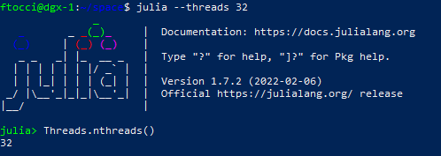
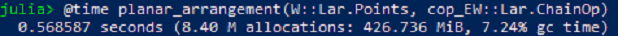

# DGX-1

Nvidia DGX è una linea di server e workstation prodotti da NVIDIA e specializzati nell'uso di GPGPU per accelerare le applicazioni di deep learning. Il componente principale di un sistema DGX è un insieme di 4-16 moduli GPU Nvidia Tesla su una scheda di sistema indipendente. I sistemi DGX sono dotati di grandi dissipatori e potenti ventole per raffreddare adeguatamente migliaia di watt di potenza termica. I moduli GPU sono tipicamente integrati nel sistema utilizzando una versione del socket SXM.

I server DGX-1 dispongono di 8 GPU basate sulle schede figlie Pascal o Volta con 128 GB di memoria HBM2 totale, collegate da una rete mesh NVLink. Il DGX-1 è stato annunciato il 6 aprile 2016. Tutti i modelli sono basati su una configurazione dual socket di CPU Intel Xeon E5 e sono dotati delle seguenti caratteristiche:

- 512 GB di DDR4-2133
- Dual 10Gb Networking
- 4 unità SSD da 1,92 TB
- Capacità di alimentazione combinata di 3200 W
- Telaio con montaggio a rack 3U

## Test su macchina

Per verificare ulteriormente i benefici apportati dal Multithreading è stato scelto di eseguire l'algoritmo su una macchina che consentisse l'impiego di molti thread. In tal senso, è stata impiegata la macchina DGX-1.

In particolare sono stati lanciati 32 thread.

Eseguendo i medesimi test sopra riportati, la macchina ha fornito il risultato illustrato nell'immagine precedente.

In proporzione, il tempo impiegato è diminuito del 42%.