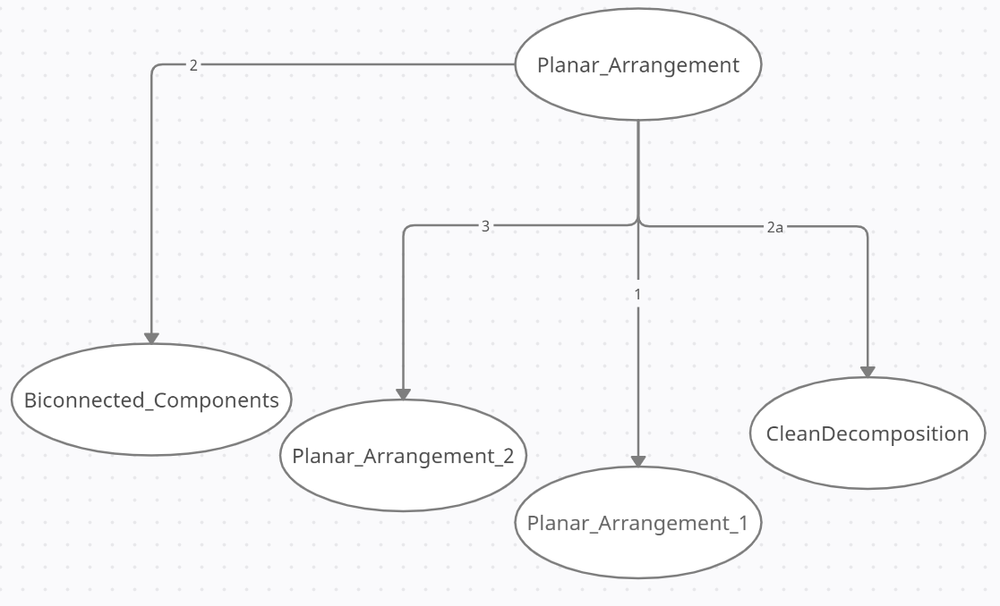
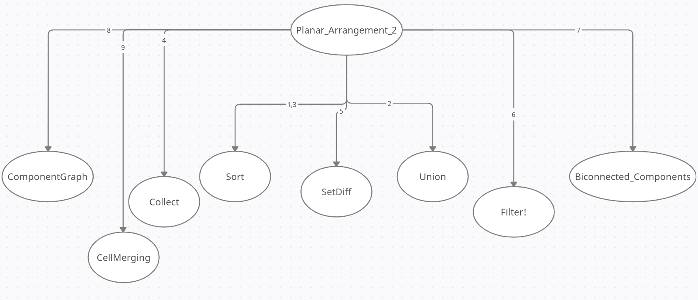

# Grafo delle Dipendenze

In questa sezione è rappresentato il grafo orientato delle dipendenze della base di codice oggetto di studio.
Ogni arco orientato rappresenta una chiamata di funzione $(v_1, v_2)$, dove $v_1$ è la funzione chiamante, e $v_2$ è la funzione chiamata. I nodi hanno un’etichetta corrispondente al nome della funzione. Gli archi invece hanno una etichetta numerica consecutiva corrispondente all’ordine delle chiamate dal nodo loro origine.

