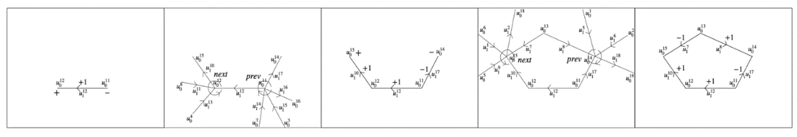

Progetto **TGW2D** per il corso di **Calcolo Parallelo e Distribuito**:

| Nome | E-mail |
|:---|:---|
|Matteo Maraziti|mat.maraziti@stud.uniroma3.it|
|Federico Tocci|fed.tocci@stud.uniroma3.it|
|Giacomo Scordino|gia.scordino1@stud.uniroma3.it|


1. # **STUDIO PRELIMINARE**
Il topological gift wrapping è un algoritmo che produce un insieme di complessi di catene in 2D.

Data una qualsiasi collezione di poliedri cellulari la computazione può essere riassunta con i seguenti passaggi:

1. Estrarre i due scheletri dei poliedri;
2. Fondere in modo efficiente tutte le loro 2-celle;
3. Calcolare su ogni 2-cella il suo complesso di catene locale.

Con tali premesse, l’obiettivo del presente elaborato è stato quello di effettuare una analisi preliminare del codice a disposizione, individuando i compiti principali che l’algoritmo svolge, le dipendenze fra le varie funzione che lo compongono e determinare eventuali criticità su cui è necessario intervenire.[2]

**1.1 Il linguaggio Julia**

L’algoritmo appena introdotto utilizza Julia come linguaggio di programmazione. Esso è stato creato con l’intento di garantire alte prestazioni, sfruttando a pieno le potenzialità del calcolo parallelo. È possibile utilizzare primitive che permettono di sfruttare a pieno i *core* delle macchine sulle quali viene messo in esecuzione il codice Julia, grazie al meccanismo di multi-threading.

Julia può inoltre generare codice nativo per GPU, risorsa che permette di abbattere ulteriormente i tempi di esecuzione dell’algoritmo.[1]

**1.2 Funzionamento**

L’algoritmo è utilizzato localmente su 2-cella per essere decomposta, e invece utilizzato globalmente per generare le 3-celle della partizione dello spazio.



Figura 1 : Estrazione di 1 ciclo minimale [2]

Per ogni elemento (1-scheletro) calcolo *il bordo* ottenendo i due vertici, per ciascun vertice calcolo il cobordo, ovvero individuo gli altri elementi (1-scheletro) con un vertice coincidente (questo passaggio viene effettuato tramite valori matriciali). A questo punto si isolano due elementi tra quelli individuati formando così una catena e si ripete l’algoritmo sugli elementi della catena appena calcolata. L’obiettivo di ciascuna iterazione è quello di individuare una porzione nel piano (ovvero la 1-catena di bordo) Figura 1. [2]

1.2.1 **Illustrazione dello pseudocodice**

Lo pseudocodice in Figura 2 è il riassunto dell’algoritmo TGW in uno spazio generico di D-dimensionale.

L’algoritmo prende in input una matrice sparsa di dimensioni “m×n” e restituisce una matrice dal dominio delle D-catene a quello dei (d-1) cicli orientati. [3]


Figura 2: pseudocodice [3]

**1.3 Funzioni interne principali**

1.3.1 **Planar Arrangement**
```
function planar_arrangement(
        V::Lar.Points,
        copEV::Lar.ChainOp,
        sigma::Lar.Chain=spzeros(Int8, 0),
        return_edge_map::Bool=false,
        multiproc::Bool=false)
#planar_arrangement_1
	V,copEV,sigma,edge_map=Lar.Arrangement.planar_arrangement_1(V,copEV,sigma,return_edge_map,multiproc)
# cleandecomposition
	if sigma.n > 0
		V,copEV=Lar.Arrangement.cleandecomposition(V, copEV, sigma, edge_map)
	end
    bicon_comps = Lar.Arrangement.biconnected_components(copEV)
    # EV = Lar.cop2lar(copEV)
    # V,bicon_comps = Lar.biconnectedComponent((V,EV))
	if isempty(bicon_comps)
    	println("No biconnected components found.")
    	if (return_edge_map)
    	    return (nothing, nothing, nothing, nothing)
    	else
    	    return (nothing, nothing, nothing)
    	end
	end
#Planar_arrangement_2
	V,copEV,FE=Lar.Arrangement.planar_arrangement_2(V,copEV,bicon_comps,edge_map,sigma)
	if (return_edge_map)
	     return V, copEV, FE, edge_map
	else
	     return V, copEV, FE
	end
end
```   

L’obiettivo è partizionare un complesso cellulare passato come parametro. Un complesso cellulare è partizionato quando l'intersezione di ogni possibile coppia di celle del complesso è vuota e l'unione di tutte le celle è l'intero spazio euclideo.

1.3.2 **Merge Vertices**
```
function merge_vertices!(V::Lar.Points, EV::Lar.ChainOp, edge_map, err=1e-4)
    vertsnum = size(V, 1)
    edgenum = size(EV, 1)
    newverts = zeros(Int, vertsnum)
    # KDTree constructor needs an explicit array of Float64
    V = Array{Float64,2}(V)
    kdtree = KDTree(permutedims(V))

    # merge congruent vertices
    todelete = []
    i = 1
    for vi in 1:vertsnum
        if !(vi in todelete)
            nearvs = Lar.inrange(kdtree, V[vi, :], err)
            newverts[nearvs] .= i
            nearvs = setdiff(nearvs, vi)
            todelete = union(todelete, nearvs)
            i = i + 1
        end
    end
    nV = V[setdiff(collect(1:vertsnum), todelete), :]

    # merge congruent edges
    edges = Array{Tuple{Int, Int}, 1}(undef, edgenum)
    oedges = Array{Tuple{Int, Int}, 1}(undef, edgenum)
    for ei in 1:edgenum
        v1, v2 = EV[ei, :].nzind
        edges[ei] = Tuple{Int, Int}(sort([newverts[v1], newverts[v2]]))
        oedges[ei] = Tuple{Int, Int}(sort([v1, v2]))
    end
    nedges = union(edges)
    nedges = filter(t->t[1]!=t[2], nedges)
    nedgenum = length(nedges)
    nEV = spzeros(Int8, nedgenum, size(nV, 1))
    # maps pairs of vertex indices to edge index
    etuple2idx = Dict{Tuple{Int, Int}, Int}()
    # builds `edge_map`
    for ei in 1:nedgenum
        nEV[ei, collect(nedges[ei])] .= 1
        etuple2idx[nedges[ei]] = ei
    end
    for i in 1:length(edge_map)
        row = edge_map[i]
        row = map(x->edges[x], row)
        row = filter(t->t[1]!=t[2], row)
        row = map(x->etuple2idx[x], row)
        edge_map[i] = row
    end
    # return new vertices and new edges
    return Lar.Points(nV), nEV
end
```

Si occupa di fondere vertici congruenti e bordi congruenti, assegnare a coppie di indici di vertici indici di bordo e costruire una mappa dei bordi.

1.3.3 **Frag Edge**
```
function frag_edge(V, EV::Lar.ChainOp, edge_idx::Int, bigPI)
    alphas = Dict{Float64, Int}()
    edge = EV[edge_idx, :]
    verts = V[edge.nzind, :]
    for i in bigPI[edge_idx]
        if i != edge_idx
            intersection = Lar.Arrangement.intersect_edges(
            	V, edge, EV[i, :])
            for (point, alpha) in intersection
                verts = [verts; point]
                alphas[alpha] = size(verts, 1)
            end
        end
    end
    alphas[0.0], alphas[1.0] = [1, 2]
    alphas_keys = sort(collect(keys(alphas)))
    edge_num = length(alphas_keys)-1
    verts_num = size(verts, 1)
    ev = SparseArrays.spzeros(Int8, edge_num, verts_num)
    for i in 1:edge_num
        ev[i, alphas[alphas_keys[i]]] = 1
        ev[i, alphas[alphas_keys[i+1]]] = 1
    end
    return verts, ev
end
```


Si occupa della frammentazione dei bordi in EV usando l'indice spaziale bigPI.

1.4 **Analisi per il miglioramento del codice** 

Analizzando il codice nel dettaglio, è possibile evidenziare che in alcuni passi dell'algoritmo è stato implementato il calcolo parallelo e distribuito. Infatti, nella funzione "*planar\_arrangement\_1*", la frammentazione dei bordi può essere effettuata tramite il calcolo asincrono. 

Continuando l'analisi del codice ed osservando accuratamente le dipendenze presenti risulta opportuno implementare modifiche con l'obiettivo di migliorare scalabilità, modificabilità e prestazioni di porzioni dello stesso, riducendo l'accoppiamento tra i moduli presenti fattorizzando il codice e continuando ad implementare forme di calcolo parallelo e distribuito. In particolare, alcune di queste modifiche dovranno coinvolgere il codice relativo alla funzione "*merge\_vertices!"*, presentata in precedenza. Infatti, ad essa sono assegnate numerose *task* che possono essere suddivise in diverse sotto funzioni.


2. # **STUDIO ESECUTIVO**

All’interno di questo capitolo verrà trattato lo sviluppo del progetto nella sua fase principale, ovvero quella riguardante la messa in atto di tutte le modifiche introdotte nel capitolo precedente.

Lo scopo principale è quello di migliorare le prestazioni dell’algoritmo preso in esame andando ad introdurre all’interno del codice porzioni che presentano la possibilità di essere eseguite in parallelo. Oltre a ciò, un secondo obiettivo è la re-fattorizzazione di alcune funzione, garantendo migliore scalabilità e modificabilità dei moduli interessati.

**2.1 Calcolo Parallelo in Julia**

Come introdotto nei paragrafi precedenti è stato deciso di migliorare le prestazioni dell’algoritmo usufruendo delle potenzialità garantite dal calcolo parallelo.
Nei prossimi paragrafi verranno illustrate le possibili implementazioni del calcolo parallelo offerta dal linguaggio di programmazione Julia.

2.1.1 ***Task* asincroni o coroutine**

I task di Julia consentono di sospendere e riprendere i calcoli per l'I/O, la gestione degli eventi e modelli simili. I task possono sincronizzarsi attraverso operazioni come *wait* e *fetch* e comunicare tramite canali. Pur non essendo di per sé un calcolo parallelo, Julia consente di programmare i *task* su più *thread*.

2.1.2 **Multithreading**

Il *multithreading* di Julia offre la possibilità di programmare task simultaneamente su più di un *thread* o core della CPU, condividendo la memoria. Questo è di solito il modo più semplice per ottenere il parallelismo sul proprio PC o su un singolo grande server *multicore*.

2.1.3 **Elaborazione distribuita**

il calcolo distribuito esegue più processi Julia con spazi di memoria separati. Questi possono trovarsi sullo stesso computer o su più computer. La libreria standard Distributed fornisce la possibilità di eseguire in remoto una funzione Julia. Con questo blocco di base, è possibile costruire molti tipi diversi di astrazioni di calcolo distribuito.

2.1.4 **Elaborazione su GPU**

Il compilatore Julia GPU offre la possibilità di eseguire codice Julia in modo nativo sulle GPU. Esiste un ricco ecosistema di pacchetti Julia che puntano alle GPU.

 **2.2 Analisi Codice** 

Prima dell’attuazione delle modifiche è stata svolta un’analisi dell’algoritmo con l’obiettivo di misurarne i tempi di esecuzione e di individuare eventuali porzioni di codice che potessero rallentare notevolmente l’esecuzione dello stesso.

In tal senso, Julia offre strumenti che possono aiutare a diagnosticare i problemi e a migliorare le prestazioni del codice. Per questa fase di studio dell’algoritmo sono stati usati: 

1. Profiling: La profilazione consente di misurare le prestazioni del codice in esecuzione e di identificare le linee che fungono da colli di bottiglia. Per la visualizzazione dei risulati è stato usato il pacchetto ProfileView [4]. (Figura 6)
2. @time: Una macro che esegue un'espressione, stampando il tempo di esecuzione, il numero di allocazioni e il numero totale di byte che l'esecuzione ha causato, prima di restituire il valore dell'espressione [5]. (Figura 7)


Figura 3: Risultato Profiling


Figura 4: Risultati test iniziale

2.3 **Implementazione delle modifiche** 
All’interno dell’algoritmo è evidente una elevata presenza di cicli, molti dei quali annidati. Per questo motivo è stato scelto di utilizzare la tecnica del Multi-threading. Julia supporta i loop paralleli utilizzando la macro Threads.@threads. Questa macro viene apposta davanti a un ciclo for per indicare a Julia che il ciclo è una regione multi-thread. 

Lo spazio di iterazione viene suddiviso tra i thread, dopodiché ogni thread scrive il proprio ID thread nelle posizioni assegnate.  
Prima di eseguire un programma Julia multithread, è necessario impostare il numero di thread. Questo puo essere impostato dalla linea di comando di Julia, utilizzando gli argomenti della riga di comando -t, o modificando la variabile d'ambiente JULIA_NUM_THREADS.[6]

A seguito delle modifiche sono stati eseguiti nuovamente i test ottenendo i risultati illustrati nella Figura 8.


Figura 5: Risultati test finale

Osservando i tempi misurati prima e dopo delle modifiche si evince un miglioramento della prestazione di circa il 30%.

2.4 **Re-fattorizzazione**

Come anticipato nei paragrafi sopra è stato scelto di aggiungere alcune nuove funzioni all’interno del codice così da ridurre le responsabilità di alcuni metodi già presenti nello stesso. Questa scelta implementativa ha coinvolto prevalentemente la funzione “*merge\_vertices*”, il cui corpo al termine delle modifiche è risultato notevolemente piu leggibile. In particolare, le funzioni che sono state aggiunte al codice sono mergeCongruentVertices (Figura 9), mergeCongruentEdges (Figura 10), buildEdgeMap (Figura 11).  


```
function mergeCongruentVertices(vertsnum,newverts,kdtree,V,err=1e-4)
    todelete = []
    i = 1
    for vi in 1:vertsnum
        if !(vi in todelete)
            nearvs = Lar.inrange(kdtree, V[vi, :], err)
            newverts[nearvs] .= i
            nearvs = setdiff(nearvs, vi)
            todelete = union(todelete, nearvs)
            i = i + 1
        end
    end
    return todelete,newverts
end

function mergeCongruentEdges(edgenum,newverts,EV)
    edges = Array{Tuple{Int, Int}, 1}(undef, edgenum)
    oedges = Array{Tuple{Int, Int}, 1}(undef, edgenum)
    @sync begin
        for ei in 1:edgenum
            @async begin
                v1, v2 = EV[ei, :].nzind
                edges[ei] = Tuple{Int, Int}(sort([newverts[v1], newverts[v2]]))
                oedges[ei] = Tuple{Int, Int}(sort([v1, v2])) 
            end
        end 
    end
    return edges,oedges
end

function buildEdgeMap(nedges,nedgenum,nEV,etuple2idx,edge_map,edges)
    for ei in 1:nedgenum
        nEV[ei, collect(nedges[ei])] .= 1
        etuple2idx[nedges[ei]] = ei
    end
    
    for i in 1:length(edge_map)
        row = edge_map[i]
        row = map(x->edges[x], row)
        row = filter(t->t[1]!=t[2], row)
        row = map(x->etuple2idx[x], row)
        edge_map[i] = row 
    end        
    return edge_map,nEV
end
```


# **BIBLIOGRAFIA**
[1]: Julia doc: <https://julialang.org/>

[2]: ACM-TSAS-2020 Section on Topological gift wrapping (TGW) in 2D in particular 2.3, 2.4 

[3]: CADJ-2021.pdf Section on Chains and Arrangements in particular 2.2. and A.1. Relevant matters (Algorithm 5)

[4] Profiling:  <https://docs.julialang.org/en/v1/manual/profile/>

[5] <Base.@time>: <https://docs.julialang.org/en/v1/base/base/#Base.@time>

[6] MultiThreading: <https://docs.julialang.org/en/v1/manual/multi-threading/#The-@threads-Macro>


