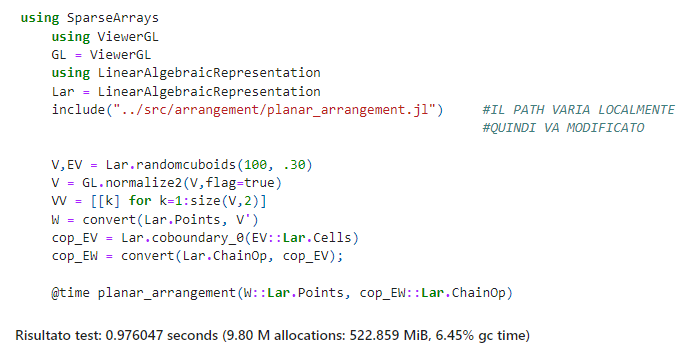
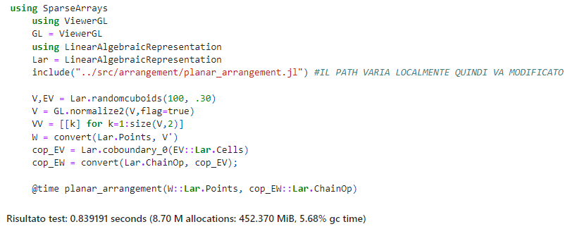

# Analisi delle Prestazioni

Nel presente capitolo vengono analizzate le prestazioni prima e dopo le 
modifiche implementate. In particolare, sono stati misurati i tempi di esecuzione
del codice iniziale. In seguito, sono state apportate modifiche al codice al fine
di gestire i 'colli di bottiglia' individuati. Infine, sono stati ricalcolati
i tempi di esecuzione dell'algoritmo e confrontati con quelli di partenza.

## Situazione di partenza

## Test Intermedi

Dopo aver implementato il multithreading sono stati eseguiti dei test con 2 e 4 thread.
Tuttavia, i tempi di esecuzione risultavano ancora instabili e non vi erano miglioramenti
significativi.

## Risultato Finale

Il test finale è stato eseguito con 8 thread portando ai seguenti risultati:

Come si evince dalla figura i tempi sono migliorati di circa il 15%.